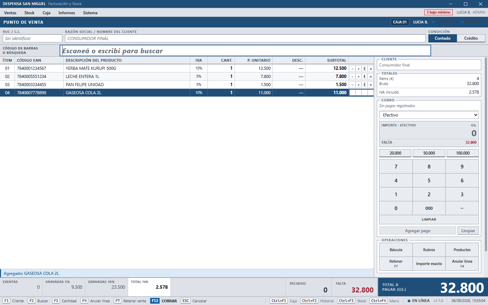
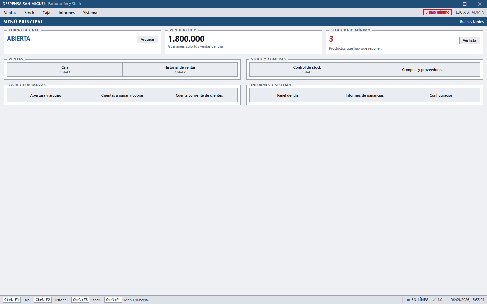
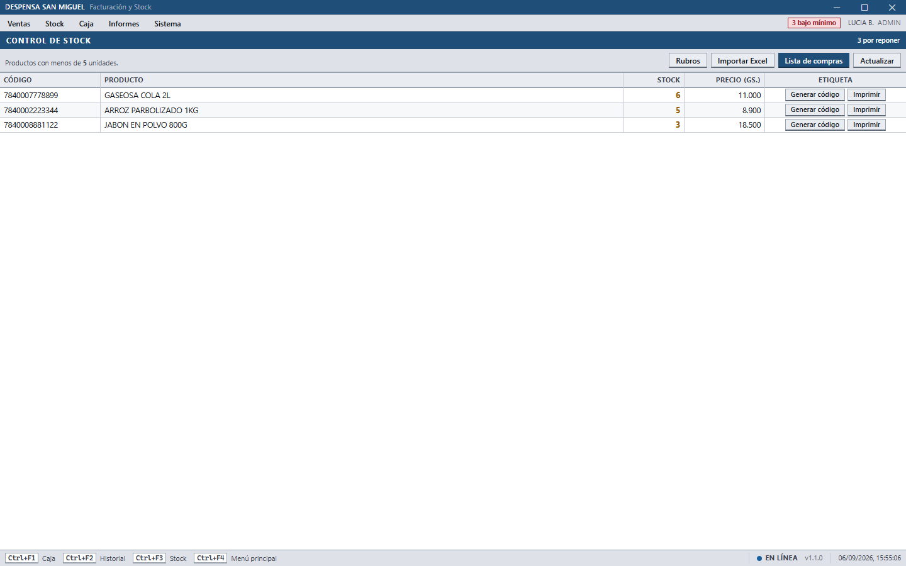
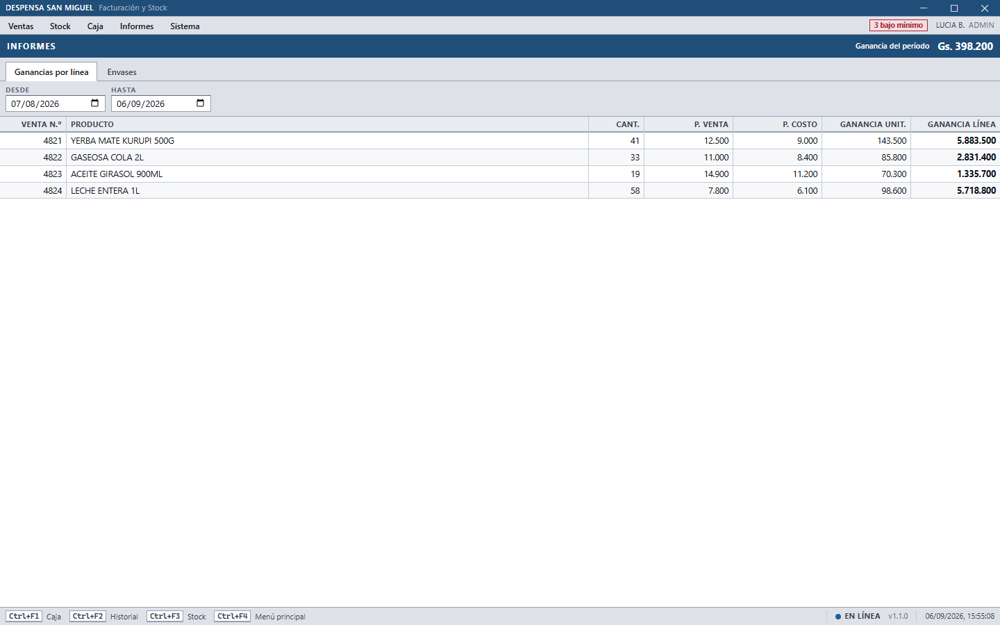

# Sistema de Facturación y Stock

Punto de venta y control de stock para supermercados en Paraguay. Aplicación de
escritorio Windows, pensada para el mostrador: se opera con lector de códigos de
barras y teclado, sin mouse, e imprime en ticketera térmica sin pasar por el
diálogo de impresión de Windows.

Está **en uso en un comercio real**, no es una maqueta.



*Pantalla de cobro. Desglose de IVA por tasa (5% y 10%), teclado numérico para
el efectivo, y toda la operación con teclas de función: el cajero no toca el
mouse. Los datos de las capturas son inventados.*

> **Software propietario.** Ver [LICENSE](LICENSE).

## Qué hace

- **Caja.** Escaneo continuo, modo cantidad, modo báscula (peso en gramos),
  venta a crédito, envases retornables, cálculo de vuelto y desglose de IVA.
- **Stock.** Alta y edición de productos, alertas por debajo del mínimo,
  importación desde Excel, impresión de etiquetas EAN-13.
- **Caja diaria.** Apertura, entradas y retiros de efectivo, cierre con arqueo
  y ticket Z.
- **Historial.** Reimpresión de tickets, anulaciones y notas de crédito con
  reposición de stock.
- **Compras, proveedores, cuentas por pagar y cobrar, cuenta corriente de
  clientes.**
- **Informes** de ganancias, envases, productos más vendidos y ventas por hora.
- **Modo offline.** La caja sigue vendiendo sin internet y sincroniza al volver.

### Cómo se ve

| Menú principal | Control de stock |
|---|---|
|  |  |
| Estado del turno, vendido del día y alerta de reposición de un vistazo. | Productos por debajo del mínimo, con generación e impresión de etiquetas EAN-13. |



*Ganancia por línea de venta, con precio de costo y de venta. El costo se guarda
por producto, así que el margen sale del dato real y no de un porcentaje fijo.*

## Stack

| Capa | Tecnología |
|---|---|
| Escritorio | Electron 31 |
| Interfaz | React 18 + TypeScript + Tailwind |
| Backend | Node.js (proceso main de Electron) |
| Base de datos | Supabase (PostgreSQL) |
| Empaquetado | electron-vite + electron-builder |

## Requisitos

- Node.js 18 o superior
- Windows 10/11 (la impresión ESC/POS escribe directo al puerto)
- Un proyecto de Supabase

## Instalación

### En un comercio

El instalador es uno solo y sirve para cualquier cliente: no lleva adentro
ninguna credencial ni ningún dato del negocio.

1. Ejecutar el `.exe`.
2. La primera vez, la aplicación pide la **dirección del proyecto Supabase** y
   la **clave de servicio**. Están en el panel de Supabase del comercio, en
   *Project Settings → API*. La clave queda guardada en esa máquina, cifrada
   con el almacén de Windows.
3. Cargar el nombre y el RUC del comercio en *Configuración*. Encabezan cada
   ticket.
4. Elegir la impresora en esa misma pantalla.

La conexión se puede cambiar después desde *Configuración*, sin reinstalar.

> **Al actualizar desde una versión anterior a la 1.1.0**, la caja va a pedir
> la conexión una vez: antes venía adentro del instalador y ahora vive en la
> máquina. Es una sola vez por terminal.

### Para desarrollar

```bash
npm install
cp .env.example .env
```

Completar `.env` con los datos del proyecto de Supabase:

```
SUPABASE_URL=
SUPABASE_ANON_KEY=
SUPABASE_SERVICE_ROLE_KEY=
TICKETERA_USB_ID=0x0416
TICKETERA_NOMBRE=5830 series
LECTOR_TIMEOUT=500
```

`SUPABASE_SERVICE_ROLE_KEY` ignora las políticas de la base. Es el respaldo del
ingreso mientras el login por usuario termina de probarse en el mostrador, y el
objetivo es dejar de necesitarla.

El `.env` **sólo sirve para desarrollo**: siembra la configuración la primera
vez que arranca la app en esta máquina, para no tener que cargarla a mano. El
instalador no lo empaqueta.

> **`.env` nunca se versiona.** Está en `.gitignore` y el historial del
> repositorio está verificado y limpio de credenciales.

Aplicar las migraciones de `supabase/migrations/` en orden, desde el SQL Editor
de Supabase o con la CLI.

## Comandos

```bash
npm run dev          # levanta la app en desarrollo
npm run typecheck    # chequea main Y renderer
npm run lint         # ESLint 9 (flat config)
npm test             # vitest: guaraní, IVA, roles, conexión y bytes del ticket
npm run build        # corre typecheck primero
npm run package      # genera el instalador
```

`npm run typecheck` no es opcional: Vite compila sin verificar tipos, así que
sin esto un error del renderer no aparece hasta ejecutar la aplicación.

## Arquitectura

```
src/
├── main/       proceso principal — services/ (negocio + Supabase), ipc/ (76 canales)
├── preload/    puente contextBridge que expone window.api
├── renderer/   React — components/ (pantallas), hooks/, contexts/
└── shared/     tipos y utilidades que cruzan procesos
```

Dos reglas que conviene saber antes de tocar código:

1. **Agregar un canal IPC toca cuatro archivos:** `shared/ipc/canales.ts`,
   `main/ipc/index.ts`, `preload/index.ts` y `shared/types/api.ts`. Un canal
   que existe de un lado y no del otro no falla al compilar: falla en
   producción.
2. **Todo lo que cruza IPC devuelve `Resultado<T>`** — `{ ok: true, data }` o
   `{ ok: false, codigo, mensaje }`. Hay que estrechar con `if (!r.ok)` antes
   de leer `mensaje`.

El renderer nunca habla con Supabase: todo pasa por IPC al proceso main, que es
el único que tiene la credencial.

## Hardware

- **Lector de códigos de barras.** USB, emula teclado, cierra cada lectura con
  `Enter`. El input de escaneo de la caja **no puede perder el foco** durante el
  cobro.
- **Ticketera térmica.** ESC/POS crudo al puerto, papel de 32 columnas. Los
  constructores `construirTicket()`, `construirNotaCredito()` y
  `construirEtiquetaCodigo()` devuelven bytes fijos, incluido el pulso que abre
  el cajón — **no se modifican**.

## Idioma

Las entidades del dominio, los nombres de tabla y los textos de interfaz van en
**español** (`productos`, `ventas`, `vuelto`, `arqueo`). Los comentarios de
código y los mensajes de commit también.

## Publicar una versión

El repositorio **es** el canal de actualizaciones: cada terminal instalada lee
`version.json` de la rama principal para saber si hay algo nuevo. Publicar mal
ese archivo no rompe nada —el actualizador exige un `sha256` válido y aborta si
no lo tiene— pero tampoco actualiza a nadie.

1. `git tag v1.1.0 && git push --tags` dispara `.github/workflows/release.yml`,
   que construye el instalador en Windows y publica un Release **en borrador**.
2. El resumen del workflow imprime el `sha256` del `.exe`.
3. Copiar ese hash y la URL del `.exe` a `version.json`, y publicar el Release.

Hasta el paso 3, ninguna caja se entera de la versión nueva. Es a propósito.

> **El repositorio tiene que ser público para que el canal funcione.** El
> actualizador pide `version.json` a `raw.githubusercontent.com` sin
> autenticarse; contra un repositorio privado eso devuelve 404 siempre —no 403,
> así que ni siquiera se distingue de un archivo que no existe— y ninguna caja
> se entera nunca de una versión nueva. Con el repositorio público la URL
> responde 200 y el canal queda operativo.

## Estado

En uso. Verificaciones en verde: `typecheck`, `lint`, `test` (78 pruebas) y
`build`, con 0 errores y 0 warnings.

> **Antes de desplegar:** revisar que las migraciones de `supabase/migrations/`
> estén todas aplicadas contra la base del comercio. El sistema no las aplica
> solo, y una función que el código llama y la base no tiene falla recién en el
> mostrador.
